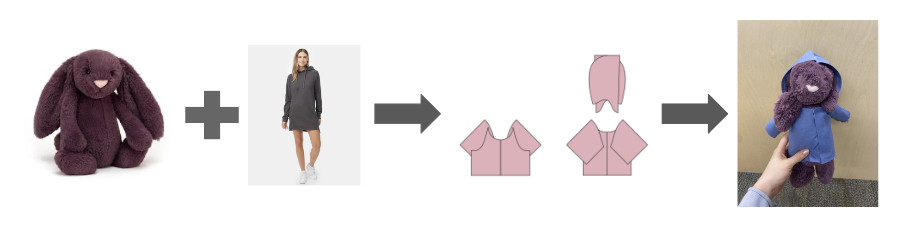

# TailorSwift [Poster](https://github.com/yixinlok/tailorswift/blob/main/poster/poster.jpg) 
Generating sewing patterns from images and body measurements 

Yixin Lok, Lavanya Mehndiratta, Brian Chu, Tamim Hasan

## Introduction

## References
1. Xu, S., Li, X., Wang, J., Cheng, G., Tong, Y., & Tao, D. (2022). Fashionformer: A simple, effective and unified baseline for human fashion segmentation and recognition. In European Conference on Computer Vision (ECCV).
2. Korosteleva, M., Kesdogan, T. L., Kemper, F., Wenninger, S., Koller, J., Zhang, Y., Botsch, M., & Sorkine-Hornung, O. (2024). GarmentCodeData: A dataset of 3D made-to-measure garments with sewing patterns. In Computer Vision – ECCV 2024.
3. Korosteleva, M., & Sorkine-Hornung, O. (2023). GarmentCode: Programming parametric sewing patterns. ACM Transactions on Graphics, 42(6), 1–16. https://doi.org/10.1145/3618351

## TODO:
1. Clean up/ refactor files
2. Download remaining pth files from compute canada
3. Add documentation
